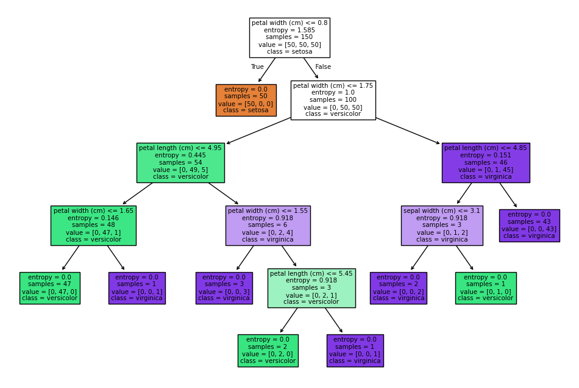

# 🌸 Clasificación de Iris con un Árbol de Decisión

Este proyecto utiliza un **árbol de decisión** para clasificar flores Iris en tres especies diferentes: *setosa*, *versicolor* y *virginica*. Utilizamos el dataset clásico de Iris, que es muy común en la enseñanza y experimentación con algoritmos de machine learning.


## 📋 Descripción del Proyecto

El objetivo de este proyecto es:

- **Entrenar un modelo de clasificación** usando un árbol de decisión.
- **Evaluar el modelo** utilizando validación cruzada para asegurar su robustez.
- **Visualizar el árbol de decisión** para entender cómo se toman las decisiones en el modelo.

Este README te guiará a través de los pasos necesarios para ejecutar el código, entender los conceptos detrás de los árboles de decisión y explorar los resultados.

## 📁 Estructura del Proyecto

- `README.md`: Este archivo, que contiene toda la información necesaria para entender y ejecutar el proyecto.
- `decision_tree_classifier.ipynb`: El script principal que carga el dataset, entrena el modelo, realiza la validación cruzada y visualiza el árbol de decisión.
- `requirements.txt`: Archivo que especifica las dependencias necesarias para ejecutar el proyecto.

## 🚀 Requisitos

Para ejecutar este proyecto, necesitas tener instalado:

- **Python 3.x**
- **scikit-learn**
- **matplotlib**

Puedes instalar todas las dependencias necesarias ejecutando:

```bash
pip install -r requirements.txt
```

## 🔨 Cómo Ejecutar el Proyecto

1. **Clona este repositorio** en tu máquina local:

    ```bash
    git clone https://github.com/DiegoLerma/decision-tree-classifier.git
    ```

2. **Navega al directorio del proyecto:**

    ```bash
    cd decision-tree-classifier
    ```

3. **Ejecuta las celdas del notebook.** Explora el contenido del notebook y ejecuta una a una las celdas.

4. **Explora los resultados:** El script generará la visualización del árbol de decisión y mostrará las precisiones obtenidas en cada fold de la validación cruzada.

## 🧠 Conceptos Clave

### Árboles de Decisión

Un árbol de decisión es un modelo de machine learning utilizado para tareas de clasificación y regresión. Divide los datos en subconjuntos más pequeños basados en características específicas, hasta que cada subconjunto (hoja) contenga datos de una sola clase.

### Validación Cruzada

La validación cruzada es una técnica para evaluar el rendimiento de un modelo. El dataset se divide en varias partes (folds), y el modelo se entrena en algunas partes y se prueba en otras. Esto asegura que el modelo no esté sobreajustado a un conjunto particular de datos.

### Visualización del Árbol

Visualizar el árbol de decisión es una excelente manera de entender cómo el modelo toma decisiones basadas en las características de los datos. Aquí te mostramos un ejemplo de cómo se ve el árbol de decisión generado en este proyecto:



## 📝 Código Explicado

### 1. Cargar el Dataset de Iris

El dataset de Iris se carga utilizando la función `load_iris` de scikit-learn. Este dataset contiene 150 muestras de flores, con cuatro características y tres clases.

```python
from sklearn.datasets import load_iris

iris = load_iris()
X, y = iris.data, iris.target
```

### 2. Crear y Entrenar el Modelo

Creamos un clasificador de árbol de decisión utilizando la clase `DecisionTreeClassifier`. Configuramos el criterio de división a `entropy` para utilizar la entropía como medida de calidad de las divisiones, y limitamos la profundidad del árbol a 10.

```python
from sklearn.tree import DecisionTreeClassifier

clf = DecisionTreeClassifier(criterion='entropy', splitter='best', random_state=0, max_depth=10)
clf.fit(X, y)
```

### 3. Validación Cruzada

Utilizamos `cross_val_score` para realizar una validación cruzada con 10 folds y obtener la precisión del modelo en cada uno.

```python
from sklearn.model_selection import cross_val_score

scores = cross_val_score(clf, X, y, cv=10)
print(scores)
```

### 4. Visualización del Árbol de Decisión

Finalmente, visualizamos el árbol de decisión entrenado utilizando `plot_tree`. Esto nos permite ver cómo el modelo divide los datos en cada nivel.

```python
from sklearn.tree import plot_tree
import matplotlib.pyplot as plt

plt.figure(figsize=(12,8))
plot_tree(clf, filled=True, feature_names=iris.feature_names, class_names=iris.target_names)
plt.show()
```

## 📊 Resultados

El modelo logró una precisión consistente en la validación cruzada, lo que indica que es capaz de generalizar bien a nuevos datos. La visualización del árbol muestra las decisiones tomadas en cada nodo, lo que proporciona una valiosa perspectiva sobre cómo el modelo clasifica las flores.

## 🛠️ Mejora y Extensión

- **Experimenta con diferentes hiperparámetros:** Prueba cambiar `max_depth`, `criterion`, o `splitter` y observa cómo afecta el rendimiento del modelo.
- **Aplica otros algoritmos de clasificación:** Intenta usar `RandomForestClassifier` o `SVM` y compara los resultados.

## 💬 Contribuciones

Las contribuciones son bienvenidas. Si encuentras algún problema o tienes alguna mejora que proponer, no dudes en abrir un issue o enviar un pull request.

## 📄 Licencia

Este proyecto está bajo la Licencia MIT. Puedes ver más detalles en el archivo `LICENSE`.
